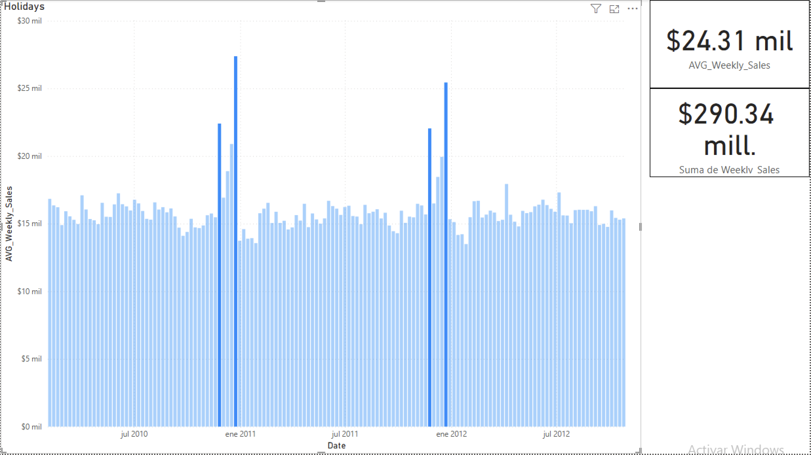
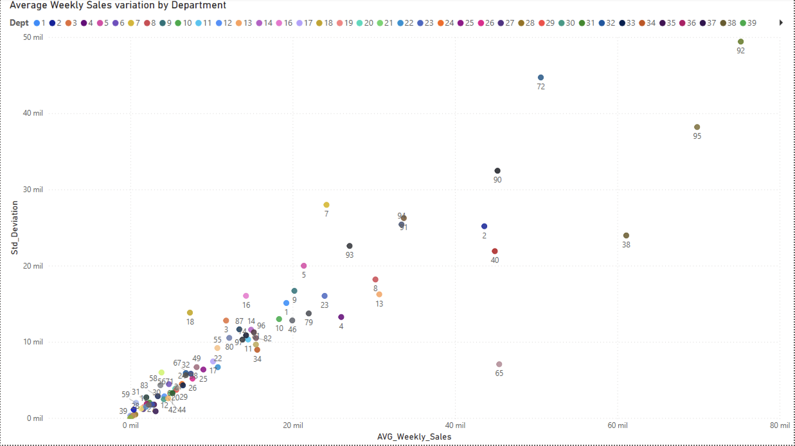
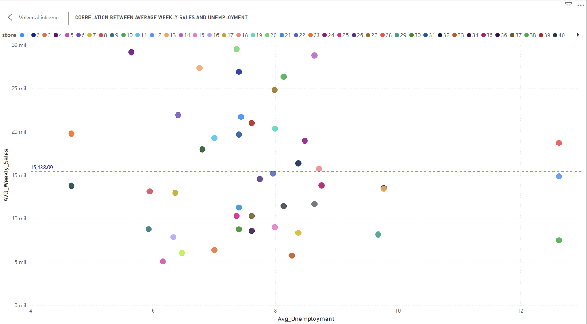
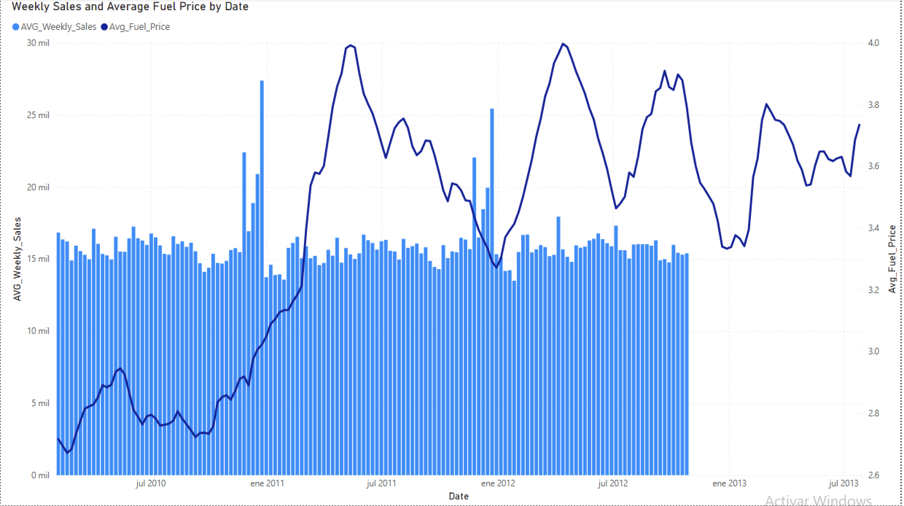
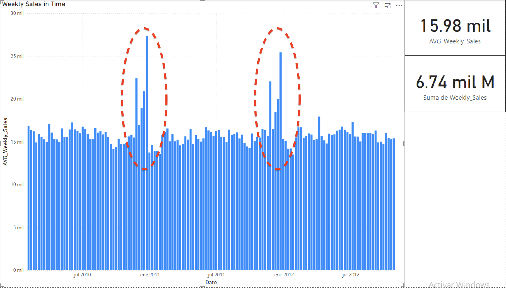
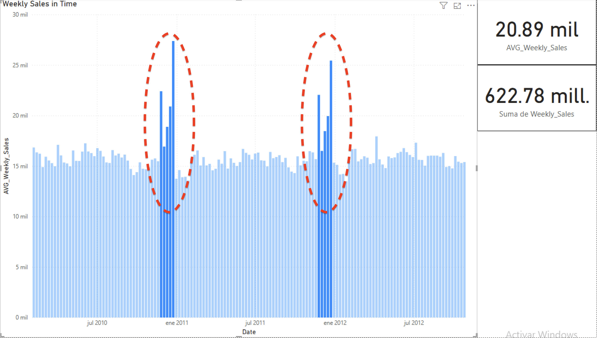

# Walmart Sales Analysis 

## Objective
Analyze Walmart's weekly sales to identify patterns, external factors affecting demand, and potential forecasts.

## Analysis Questions

## 1. Which stores generate the highest total and average sales?

R: Stores 20, 4 and 14 are the ones with the highest average and total amount of Weekly Sales.

 

## 2. How do holiday weeks affect sales?

R: Holiday weeks tend to generate higher sales compared to regular weeks.  
On average, sales during holiday weeks are **7.31% higher** than during non-holiday periods.

This indicates that customers significantly increase their spending during major holidays, likely driven by seasonal promotions and increased store traffic.  
When observing the time series, noticeable sales spikes occur around **Thanksgiving, Christmas, and New Year’s**, confirming the strong seasonal pattern in consumer behavior.

This pattern is relevant for forecasting and inventory planning, as it suggests that sales forecasts should incorporate holiday effects to avoid underestimating demand.  




## 3. Which departments have the greatest variability?

R: ## 3. Which departments have the greatest variability?

Departments **92, 72, and 95** show the highest volatility in weekly sales.  
This means that their sales fluctuate significantly over time compared to other departments.

Such high variability often indicates products with strong seasonal demand, high price sensitivity, or dependence on promotional campaigns.  
In contrast, departments with low standard deviation tend to have more stable and predictable sales, often linked to essential or frequently purchased items.

Understanding this volatility is crucial for demand forecasting and inventory management, as these departments require more flexible stock and pricing strategies.




## 4. Is there a relationship between unemployment and sales?

R: To explore whether economic conditions influence customer spending, a correlation analysis was performed between **unemployment rates** and **weekly sales** across all stores and dates.  

The resulting Pearson correlation coefficient between unemployment and weekly sales is approximately -0.026.

This value indicates a very weak negative correlation, suggesting that changes in unemployment levels do not have a significant impact on sales performance within the analyzed period (2010–2012).

In other words, higher unemployment slightly correlates with lower sales, but the effect is statistically negligible.
This could imply that Walmart’s customer base is relatively resilient to macroeconomic fluctuations, or that other factors — such as holidays, pricing, or promotions — have a stronger influence on sales behavior.



## 5. How do sales vary depending on the price of gasoline?
R: The visualization below analyzes the relationship between Weekly Sales and Average Fuel Price over time.

The dark blue line represents the average fuel price, while the blue bars show the average weekly sales for all departments.

Fuel prices exhibit noticeable fluctuations, with clear peaks around early 2011 and mid-2012. During these periods of higher gasoline prices, a slight decline in average weekly sales can be observed, suggesting a potential negative correlation between both variables.

This pattern indicates that as fuel prices rise, customers may reduce discretionary spending, indirectly impacting store sales. Conversely, when fuel prices decrease, sales tend to stabilize or increase slightly.

Overall, while the relationship is not perfectly inverse, the trend supports the hypothesis that higher fuel costs can negatively influence consumer spending and sales performance.



## 6. What trends are observed in weekly sales (seasonality)?

R: The sales period analyzed goes from February 2010 to October 2012.
During this time, the total sales amounted to 6.74 billion USD, with an average of 15.98K USD per week.

 . 

Two clear seasonal peaks can be observed in December 2010 and December 2011.
During these high-demand periods, total sales reached 622.7 million USD, with an average weekly sales of 20.89K USD.

 . 

This pattern strongly suggests seasonality driven by holiday shopping behavior, where sales increase significantly during the end-of-year period, likely due to Christmas and holiday promotions.

Between peaks, sales remain relatively stable, showing slight drops during mid-year months, which may correspond to lower consumer spending or reduced seasonal demand.

Overall, the data indicates a predictable annual cycle, where sales consistently rise at the end of each year, providing a valuable insight for inventory planning, marketing campaigns, and forecasting models.


## Analysis tools
- **Microsoft Excel** → data cleaning and initial exploration 
- **SQL** → queries and aggregations
- **Power BI** → Dashboard and visuals

## Expected Results

- Top performing stores/departments.
- Evidence of seasonality on holidays.
- Business recommendations based on external factors.

## Visuaization examples
-- /Users/argenisibarra/Documents/Portfolio/Visuals

## Data Source

Original Kaggle Dataset: [Walmart Recruiting - Store Sales Forecasting](https://www.kaggle.com/c/walmart-recruiting-store-sales-forecasting/data) 

## Loading and Cleaning process

## 1. Creation of the Walmart database on MySQL Workbench and the subsequent tables [Check Cleaning and agreggations.sql file].

```sql

-- Creation of the database --

CREATE DATABASE Walmart;
USE Walmart;

CREATE TABLE features (
id INT AUTO_INCREMENT PRIMARY KEY,
    store INT,
    date DATE,
    temperature DECIMAL (10,2),
    Fuel_Price DECIMAL(10,2),
    MarkDown1 DECIMAL (10,2),
	MarkDown2 DECIMAL (10,2),
	MarkDown3 DECIMAL (10,2),
	MarkDown4 DECIMAL (10,2),
	MarkDown5 DECIMAL (10,2),
    CPI DECIMAL (10,7),
    Unemployment DECIMAL (10,5),
    IsHoliday VARCHAR (100)
);
CREATE TABLE stores ( 
id INT AUTO_INCREMENT PRIMARY KEY, 
Store INT, 
Type CHAR(1), 
Size INT
);

CREATE TABLE test ( 
id INT AUTO_INCREMENT PRIMARY KEY, 
Store INT, 
Dept INT, 
Date DATE,
IsHoliday BOOLEAN
);

CREATE TABLE train ( 
id INT AUTO_INCREMENT PRIMARY KEY, 
Store INT, 
Dept INT, 
Date DATE,
Weekly_Sales DECIMAL (10,2),
IsHoliday BOOLEAN
);
```

## 2. Loading the Multiple CSV Files into MySQL Workbench

To prepare the Walmart database, several CSV files were imported into MySQL Workbench. The tables include:

- `stores`
- `features`
- `train`
- `test`

The CSV files were processed to handle missing values and format dates correctly.  
For detailed SQL operations, including data cleaning, type conversions, and aggregations, please refer to the script: [Cleaning_And_Agreggations.sql](./Cleaning_And_Agreggations.sql)

## 3. Familiarization with dataset:

```sql
-- See basic info
DESCRIBE Walmart.stores;
DESCRIBE Walmart.features;
DESCRIBE Walmart.test;
DESCRIBE Walmart.train;

-- Quick counts
SELECT COUNT(*) FROM Walmart.train;
SELECT COUNT(DISTINCT Store) FROM Walmart.stores;
SELECT COUNT(*) FROM Walmart.features;
SELECT COUNT(*) FROM Walmart.test;

SELECT COUNT(DISTINCT Dept) FROM Walmart.test;
SELECT COUNT(DISTINCT Dept) FROM Walmart.train;
```

## 4. Cleaning process: 

### Duplicate rows in Train Table
```sql
SELECT Store, Dept, Date, COUNT(*) 
FROM Walmart.train
GROUP BY Store, Dept, Date
HAVING COUNT(*) > 1;
```

### Duplicate rows in test Table
```sql
SELECT Store, Dept, Date, COUNT(*) 
FROM Walmart.test
GROUP BY Store, Dept, Date
HAVING COUNT(*) > 1;

SELECT DISTINCT HEX(IsHoliday) AS HexValue, IsHoliday
FROM Walmart.train
;

SELECT DISTINCT HEX(IsHoliday) AS HexValue, IsHoliday
FROM Walmart.test
;

UPDATE Walmart.train
SET IsHoliday = TRIM(REPLACE(IsHoliday, '\r', ''))
;


-- 45 Stores, 81 Depts, 10 Holidays in train table, 3 on test table
```

## 5. Aggregations

```sql
-- Sales per Store, being store 20 the one with the highest amount of sales  --

SELECT Store, SUM(Weekly_Sales) AS TotalSales
FROM Walmart.train
GROUP BY Store
ORDER BY TotalSales DESC
LIMIT 100
;

-- Average Sales per Department. Dept 92 has the highest average of sales --

SELECT Dept, AVG(Weekly_Sales) AS AvgSales
FROM Walmart.train
GROUP BY Dept
ORDER BY AvgSales DESC
;


-- Variability per Department --

SELECT 
    Dept,
    ROUND(AVG(Weekly_Sales), 2) AS Avg_Sales,
    ROUND(STDDEV(Weekly_Sales), 2) AS Std_Deviation
FROM Walmart.train
GROUP BY Dept
ORDER BY Std_Deviation DESC
LIMIT 10;

-- Effect of Holidays in Sales--

SELECT 
UPPER(TRIM(IsHoliday)) AS IsHoliday,
AVG(Weekly_Sales) AS Avg_Sales
FROM Walmart.train
GROUP BY UPPER(TRIM(IsHoliday))
;

SELECT 
    CONCAT(ROUND(
        ((Holiday.Avg_Sales - NoHoliday.Avg_Sales) / NoHoliday.Avg_Sales) * 100, 2
    ), '%') AS Diff_Percent
FROM 
    (
        SELECT AVG(Weekly_Sales) AS Avg_Sales
        FROM Walmart.train
        WHERE UPPER(TRIM(IsHoliday)) = 'TRUE'
    ) AS Holiday,
    (
        SELECT AVG(Weekly_Sales) AS Avg_Sales
        FROM Walmart.train
        WHERE UPPER(TRIM(IsHoliday)) = 'FALSE'
    ) AS NoHoliday;


--Diff_Percent is 7.31%, which means that sales on Holidays, in average, are slightly higher than the No Holidays average sales. 

--  Correlation between Unemployment and Sales, returning the average unemployment rate and the average weekly sales per store. --

SELECT 
    t.Store,
    AVG(f.Unemployment) AS Avg_Unemployment,
    AVG(t.Weekly_Sales) AS Avg_Weekly_Sales
FROM Walmart.train t
JOIN Walmart.features f
    ON t.Store = f.Store 
    AND t.Date = f.Date
GROUP BY t.Store
ORDER BY Avg_Weekly_Sales ASC
;

-- Purpose: To analyze the general relationship between stores without the noise of weekly fluctuations. --

-- The Store with the lowest average on sales is not the one with the highest average unemployment rate. Since the correlation isn't obvious, The Pearson correlation will be computed. --

-- Correlation between variables, If the correlation value is negative, it indicates that higher unemployment rates are associated with lower sales — suggesting that economic conditions directly influence consumer spending. If it’s close to zero, there’s no significant relationship between unemployment and sales. If it’s positive, higher unemployment correlates with higher sales, which would be unexpected and likely explained by other local or seasonal factors. --

SELECT 
    (AVG(f.Unemployment * t.Weekly_Sales) 
    - AVG(f.Unemployment) * AVG(t.Weekly_Sales))
    / (STD(f.Unemployment) * STD(t.Weekly_Sales)) AS corr_unemployment_sales
FROM Walmart.train t
JOIN Walmart.features f
    ON t.Store = f.Store 
    AND t.Date = f.Date
;

-- The correlation between unemployment and average weekly sales across stores is approximately -0.026, indicating no significant relationship. This suggests that, within this dataset, fluctuations in unemployment rates do not have a meaningful impact on weekly sales at Walmart stores. --

-- For a more detailed temporal analysis, every weekly observation was kept:

SELECT 
    t.Store,
    f.Unemployment,
    AVG(t.Weekly_Sales) AS Avg_Weekly_Sales,
    t.Date
FROM Walmart.train t
JOIN Walmart.features f
    ON t.Store = f.Store 
    AND t.Date = f.Date
GROUP BY t.Store, f.Unemployment, t.Date
ORDER BY f.Unemployment
;

-- Purpose: To capture potential temporal variations in unemployment and their effect on weekly sales. --

SELECT 
    (AVG(f.Unemployment * t.Weekly_Sales) 
    - AVG(f.Unemployment) * AVG(t.Weekly_Sales))
    / (STD(f.Unemployment) * STD(t.Weekly_Sales)) AS corr_weekly
FROM Walmart.train t
JOIN Walmart.features f
    ON t.Store = f.Store 
    AND t.Date = f.Date
    ;
-- Correlation = '-0.025863716257582454'
-- Interpretation: Even when using all weekly data, the correlation remains very low, confirming that fluctuations in unemployment did not significantly influence sales in this dataset.


